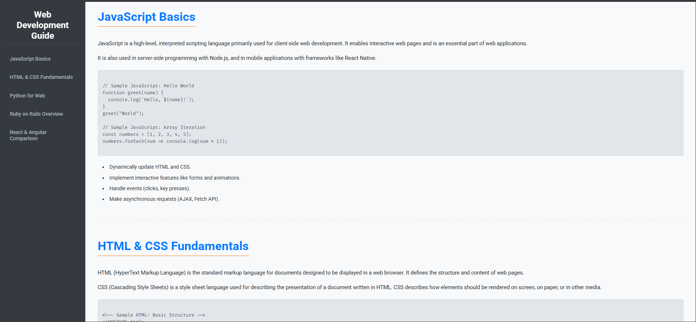

# Technical Documentation Page

A responsive web page designed to display technical documentation, featuring a fixed sidebar navigation and a collapsible hamburger menu for mobile devices.

---

## ✨ Features

- **Fixed Sidebar Navigation**  
  A persistent vertical navigation bar on larger screens, enabling quick access to documentation sections.

- **Collapsible Hamburger Menu**  
  On mobile devices, the sidebar transforms into a slide-in hamburger menu for a cleaner layout.

- **Content Sections**  
  Covers various programming topics:
  - JavaScript
  - HTML & CSS
  - Python
  - Ruby on Rails
  - React & Angular

- **Formatted Code Blocks**  
  Includes syntax-highlighted, pre-formatted blocks for easy code readability and line wrapping.

- **Smooth Scrolling**  
  Clicking sidebar links scrolls smoothly to each section, taking the fixed header into account.

- **Responsive Design**  
  Ensures optimal viewing and usability across desktops, tablets, and mobile devices.

---

## 🛠 Technologies Used

- **HTML5**
- **CSS3**  
  - CSS Variables  
  - Flexbox & Grid  
  - Media Queries

- **JavaScript**  
  - Mobile menu toggle  
  - Smooth scrolling navigation with offset

---

## 🚀 How to Run Locally

1. Save the HTML file as `index.html`
2. Save the CSS file as `styles.css` in the same folder
3. Save the JavaScript file as `script.js` in the same folder
4. Open `index.html` in your browser

---

## 🙏 Credits

Designed and developed with the assistance of **Gemini AI**.
