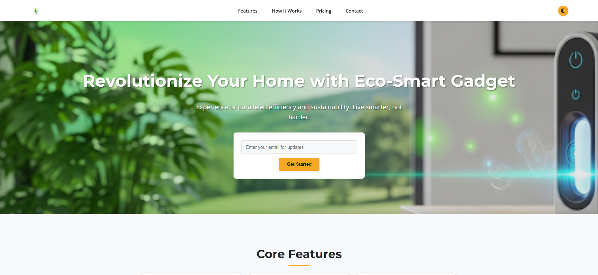

# Product Landing Page: Eco-Smart Gadget

A modern and responsive product landing page for a fictional "Eco-Smart Gadget," designed to showcase features, pricing, and capture user interest.

---

## ✨ Features

- **Sticky Header**  
  Fixed navigation bar with a logo, section links, and a theme toggle button.

- **Hero Section**  
  Prominent introduction with a bold headline, description, and email subscription form.

- **Dynamic Theme Toggle**  
  Switch between **Day** and **Night** modes — preference is saved using localStorage.

- **Core Features Section**  
  Displays product highlights in a clean, responsive grid.

- **Embedded Video**  
  Demonstrates the product with a mobile-friendly, responsive video player.

- **Tiered Pricing**  
  Shows pricing plans using a responsive Flexbox layout.

- **Contact Form**  
  Collects inquiries and user messages with well-styled input fields.

- **Smooth Scrolling Navigation**  
  Navigation links scroll smoothly to their respective sections, offset by the sticky header.

- **Responsive Design**  
  Optimized for all screen sizes — from desktops to tablets to mobile devices.

---

## 🛠 Technologies Used

- **HTML5**
- **CSS3**  
  - CSS Variables for consistent theming  
  - Flexbox and Grid layout systems  
  - Media Queries for responsiveness

- **JavaScript**  
  - Theme toggling  
  - Smooth scrolling for internal links

- **Font Awesome**  
  - Icons for features and UI polish

---

## 🚀 How to Run Locally

1. Save the HTML file as `index.html`
2. Save the CSS file as `styles.css`
3. Save the JavaScript file as `script.js`
4. Ensure you have an internet connection to load:
   - **Google Fonts**
   - **Font Awesome icons**
5. Open `index.html` in your preferred browser

---

## 🙏 Credits

Designed and developed with the assistance of **Gemini AI**.
