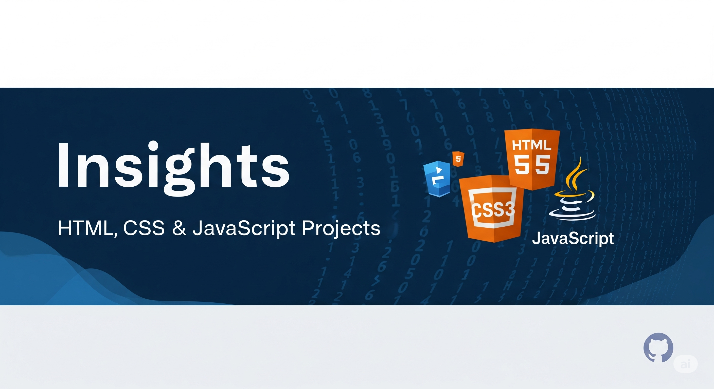

# 🚀 Insights



> A curated front-end project lab focused on **real UI patterns, JavaScript logic, and interactive systems**.

---

## ✨ What is This?

**Insights** is not just a repo. It is a **modular learning system**.

Each project is designed to:

- Practice a **specific frontend skill**
- Be **reusable in larger applications**
- Build toward **real-world development workflows**

Think of it as your **personal frontend toolkit + playground**.

---

## 🧭 Project Atlas

### 🏗️ Foundational Pages

> Build structure. Master layout. Understand semantics.

- [Survey Form](Survey_Form/README.md)
- [Tribute Page](Tribute_Page/README.md)
- [Documentation Page](Documentation_Page/README.md)
- [Product Landing Page](Product_Landing_Page/README.md)

**Focus:** Semantic HTML, responsive design, content structure  
**Stack:** HTML, CSS, JavaScript

---

### 🛠️ Utility & Conversion Apps

> Logic-first projects that sharpen problem-solving.

- [Cash Register](Cash_Register/index.html)
- [Decimal to Binary](DecimalToBinary/index.html)
- [Roman Numeral Converter](RomanNumeralConvertor/index.html)
- [Palindrome Checker](palindrome_checker/index.html)
- [Spreadsheet](Spreadsheet/index.html)

**Focus:** Input handling, transformations, validation logic  
**Stack:** HTML, CSS, JavaScript

---

### 🌐 Data & API Apps

> Real-world data integration and async workflows.

- [Forum Page](Forum_Page/index.html)
- [RPG Creature Search App](RPG_Creature_Search_App/index.html)

**Focus:** Fetch API, async flows, dynamic rendering  
**Stack:** HTML, CSS, JavaScript

---

### 🎮 Interactive Games

> Systems thinking + real interactivity.

- [Dice Game](Dice_Game/Index.html)
- [Platformer Game](platformer_game/index.html)

**Focus:** State management, game loops, collisions  
**Stack:** HTML, CSS, JavaScript, Canvas API

---

### 🎨 Portfolio & Presentation

> Where engineering meets design.

- [Portfolio](Portfolio/index.html)
- [Portfolio 1.0](Portfolio_1.0/index.html)
- [Redesign](Redesign/index.html)

**Focus:** UI/UX, storytelling, polish  
**Stack:** HTML, CSS, JavaScript, Tailwind, Chart.js

---

### ⚛️ Framework Sandbox

> Transition into modern frontend architecture.

- [React Step 1](React/Step1/step1/README.md)

**Focus:** Components, state, controlled inputs  
**Stack:** React, Vite

---

## 🧩 Feature Library

Use this repo like a **component bank for ideas**:

| Capability | Projects |
| --- | --- |
| 📝 Forms & Validation | Survey Form, Product Landing Page, Cash Register |
| 🌐 API Integration | Forum Page, RPG Creature Search App |
| 🔁 State Management | Dice Game, Spreadsheet, Platformer Game |
| 🔢 Data Transformation | Decimal to Binary, Roman Converter |
| 📊 Dynamic Rendering | Forum Page, Spreadsheet |
| 🎞️ Animations & Feedback | Dice Game, Portfolio, Redesign |
| 🎮 Game Systems | Platformer Game |

---

## 🧠 How to Use This Repo

### 🔹 Option 1: Learn Sequentially

Follow project difficulty from basic to advanced.

### 🔹 Option 2: Build a Mega App

Combine modules like LEGO:

1. Start with a layout (Portfolio or Landing Page)
2. Add utilities (Cash Register, Converter)
3. Integrate APIs (Forum + RPG app)
4. Plug in a game module
5. Upgrade to React

---

## ⚡ Quick Start

```bash
git clone https://github.com/Mystify7777/Insights.git
cd Insights
cd Survey_Form
```

Then open:

```text
index.html
```

For API-based projects, run a local server.

---

## 📁 Repository Structure

```text
Insights/
|
|-- Cash_Register
|-- DecimalToBinary
|-- Dice_Game
|-- Documentation_Page
|-- Forum_Page
|-- palindrome_checker
|-- platformer_game
|-- Portfolio
|-- Portfolio_1.0
|-- Product_Landing_Page
|-- React
|-- Redesign
|-- RomanNumeralConvertor
|-- RPG_Creature_Search_App
|-- Spreadsheet
|-- Survey_Form
`-- Tribute_Page
```

---

## 🧱 Philosophy

This repo is built on three principles:

- **Learn by building**
- **Reuse what you build**
- **Scale gradually**

---

## 🤖 Credits

Built and iterated using **AI-assisted development workflows**.  
Focused on **practical engineering over theory**.

---

## 🚀 Future Direction

- Convert projects into reusable components
- Create a unified dashboard app
- Migrate to full React architecture
- Add backend integrations

---

## ⭐ Final Note

If you are exploring this repo:

> You are not just looking at projects. You are looking at a **system to become a better developer**.
