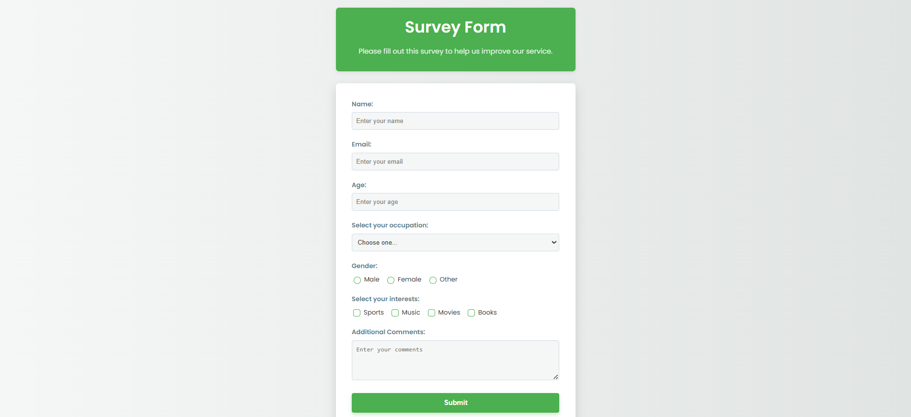

# Survey Form

A responsive and aesthetically pleasing survey form designed for collecting user feedback.

---

## ✨ Features

- **User Input Fields**  
  Collects basic user information like **name**, **email**, and **age**.

- **Selection Options**  
  Includes:
  - A dropdown menu for **occupation**
  - **Radio buttons** for gender selection
  - **Checkboxes** for multiple interests

- **Comments Section**  
  A `textarea` field for users to share additional thoughts or feedback.

- **Responsive Design**  
  Adapts gracefully to various screen sizes: **desktop**, **tablet**, and **mobile**.

- **Modern Styling**  
  Utilizes:
  - **CSS Variables** for consistent theming  
  - Clean **typography**  
  - Subtle **shadows**, **hover effects**, and a polished user experience

---

## 🛠 Technologies Used

- **HTML5**
- **CSS3**  
  - CSS Variables  
  - Flexbox for layout  
  - Media Queries for responsiveness

---

## 🚀 How to Run Locally

1. Save the HTML code as `index.html`
2. Save the CSS code as `styles.css` (in the same directory)
3. Open `index.html` in your web browser

---

## 🙏 Credits

Designed and developed with the assistance of **Gemini AI**.
