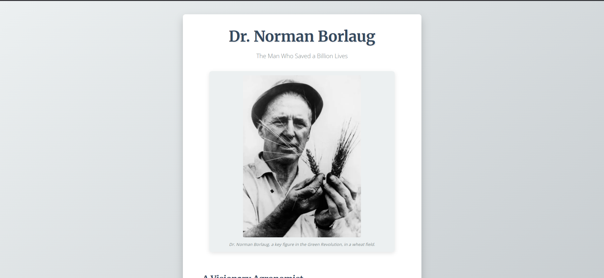

# Tribute Page: Dr. Norman Borlaug

A responsive web page dedicated to Dr. Norman Borlaug, highlighting his life and significant contributions to the Green Revolution.

---

## ✨ Features

- **Main Title & Subtitle**  
  Prominently displays Dr. Borlaug’s name along with a meaningful tagline.

- **Image with Caption**  
  Includes a relevant photo, semantically wrapped using `<figure>` and `<figcaption>` for accessibility and clarity.

- **Detailed Information Section**  
  Highlights Borlaug’s achievements, key moments, and includes a memorable quote.

- **External Link**  
  A clear call-to-action button or link to learn more about his legacy.

- **Responsive Design**  
  Ensures seamless viewing on all screen sizes — mobile, tablet, and desktop.

- **Modern Styling**  
  Uses:
  - A soft and readable **color palette**
  - **Google Fonts** for professional typography
  - Custom **list item styles** for visual clarity

---

## 🛠 Technologies Used

- **HTML5**
- **CSS3**  
  - CSS Variables  
  - Flexbox  
  - Media Queries for responsive layout

---

## 🚀 How to Run Locally

1. Save the HTML code as `index.html`
2. Save the CSS code as `styles.css` in the same folder
3. Open `index.html` in any modern web browser

---

## 🙏 Credits

Designed and developed with the assistance of **Gemini AI**.
